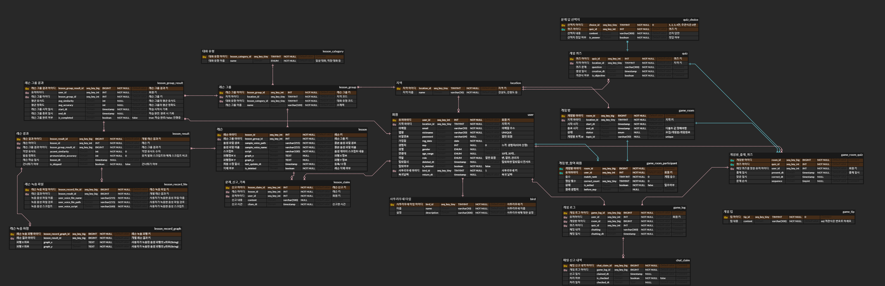

# 구미1반_D104
- 팀장 : 이진주
- 팀원 : 허태훈, 박동현, 박민규, 하재훈, 김도환, 허동원
### 서비스명: 사투리가 서툴러유
### 서비스 개요 
- 사투리를 배우고 싶은 사람은 사투리를, 표준어를 배우고 싶은 사람은 표준어를 학습할 수 있는 지역어 학습 서비스
### 서비스 기능
- 학습
  - 주어진 제시 음성과 사용자가 녹음한 음성을 비교 분석하여 파형 유사도, 발음 정확도 제공
  - 구현
    - 음성 피치 인식 > 그래프 파형 : Tensorflow Hub에 업로드 되어 있는 SPICE 모델 사용
    - 그래프 파형간 유사도 분석 : cross_correlation, DTW(fastdtw)
- 게임
  - 다른 사용자와 사투리 관련 스피드 퀴즈
  - 구현
    - 실시간 웹소켓 통신을 활용한 게임 진행
### ERD 설계

### 서비스 목업
- 메인화면

- 학습화면

- 게임화면

- 회원페이지

### 프로젝트 관리
- 일정

