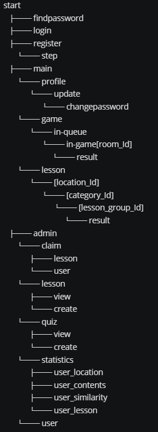

# 구미1반_D104

- 팀장 : 이진주
- 팀원 : 허태훈, 박동현, 박민규, 하재훈, 김도환, 허동원

## 1. 서비스명: 사투리가 서툴러유

## 2. 서비스 개요

- 사투리를 배우고 싶은 사람은 사투리를, 표준어를 배우고 싶은 사람은 표준어를 학습할 수 있는 지역어 학습 서비스
  

## 3. 서비스 기능

### 1) 학습

- 주어진 제시 음성과 사용자가 녹음한 음성을 비교 분석하여 파형 유사도, 발음 정확도 제공
- 흐름
  
- 구현
  
  

### 2) 게임

- 다른 사용자와 사투리 관련 스피드 퀴즈
- 흐름
  
- 구현
    - 실시간 웹소켓 통신을 활용한 게임 진행

## 4. ERD

  

## 5. URL 경로 구조

  

## 6. 서비스 페이지

### 1) 메인

- 로그인 이전
  

- 로그인 이후
  

### 2) 학습
- 레슨 그룹 선택
  

- 레슨
  

### 3) 게임
- 게임 진행
  

- 게임 결과
  

### 4) 회원 페이지
- 프로필
  

### 5) 관리자 페이지
- 통계
  

- 관리
  

